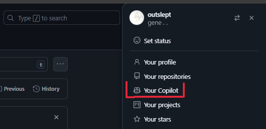

# Github No Copilot

This userscript automatically removes all GitHub Copilot elements from the GitHub web interface, providing a clean experience without AI features.

### What the script removes:

1. App Header Icon

2. Home Page

3. Issues Page

4. PR Review

5. Search Results

6. Sidebar

